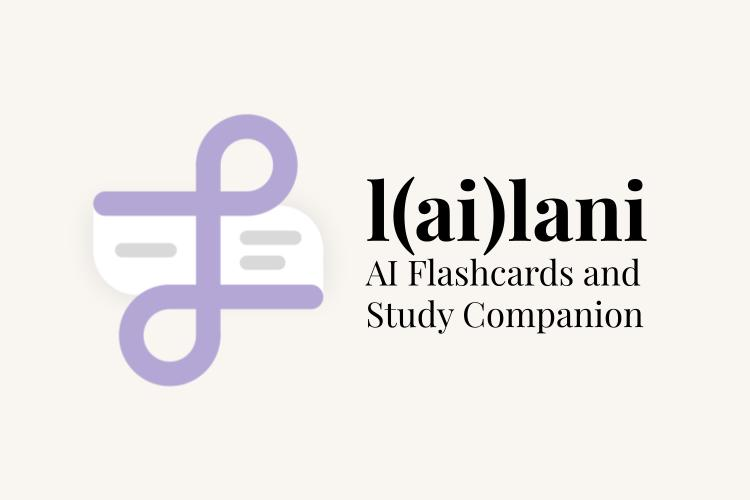

# l(ai)lani: AI Flashcards and Study Companion

Studying complex topics can be overwhelming, especially when faced with dense textbooks, lengthy PDFs, and scattered notes. We wanted to create a seamless, AI-powered tool that could instantly transform study materials into interactive flashcards and insightful research summaries. The goal was to save time, enhance learning efficiency, and make studying more engaging.

# Technologies We Used

We used React as a front end, and Flask for the backend. Our main logic for gathering information and communicating with the API's were done using Python. We used Perplexity AI and their sonar and sonar-deep-research models for our Research and Deep Research functionality, while incorporating groq's quick AI inference for Notes file ingest, as well as for collecting topics for creating the flashcards. 

# Core Features

- Smart File Upload
- Upload PDFs, DOCs, TXTs, and Markdown files
- AI scans the file and extracts important topics automatically

# Flashcard Generation

- Groq AI instantly creates flashcards based on uploaded content
- Flashcards cover key points, definitions, and questions

# AI-Powered Research

- Research Mode: Uses Perplexity AI for AI-driven explanations
- Deep Research Mode: Provides in-depth analysis with Sonar Deep Research

# Contributors
- Nikola Paunovic - Back-end developer
- Rowwel Ponesto - Back-end developer
- Patrick Gatpandan - Front-end developer
- Xiaojun Gong - Front-end developer

© 2025 snail pace creations. All rights reserved.
This software and its contents may not be copied, modified, or distributed without explicit permission from snail pace creations.
